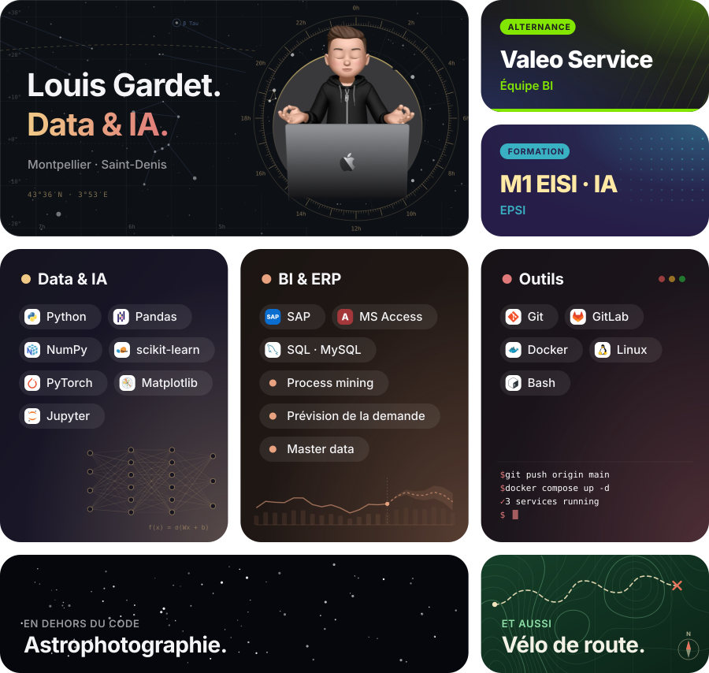

  <picture>
    <source media="(prefers-color-scheme: dark)" srcset="assets/bento-dark.svg" />
    
  </picture>

 

  <a href="https://linkedin.com/in/louis-gardet">LinkedIn</a>&nbsp;&nbsp;·&nbsp;&nbsp;
  <a href="https://www.kaggle.com/louisgardet">Kaggle</a>&nbsp;&nbsp;·&nbsp;&nbsp;
  <a href="https://stackoverflow.com/users/22061174">Stack Overflow</a>&nbsp;&nbsp;·&nbsp;&nbsp;
  <a href="https://dev.to/louisgardet">dev.to</a>

